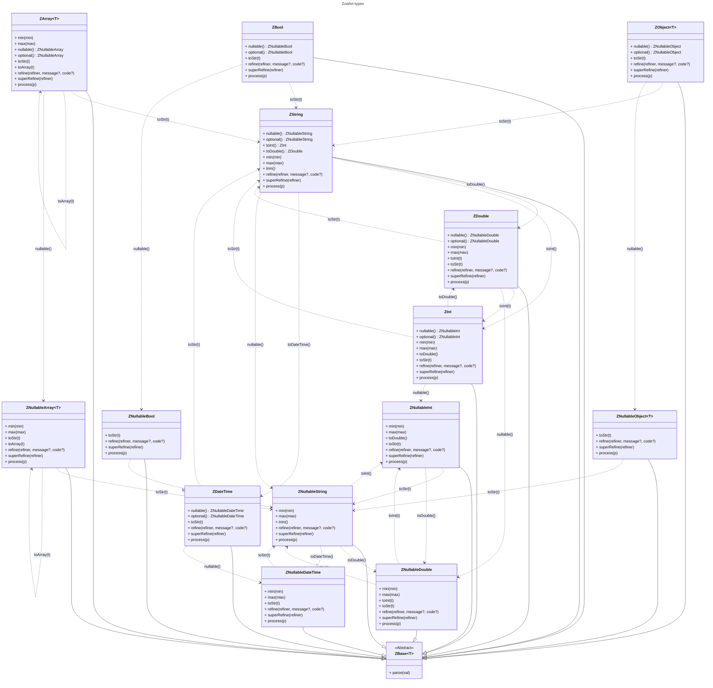

## Type conversions

| ⬇️From ➡️To Type             | **ZBool** | **ZInt**  | **ZDouble** | **ZDateTime** | **ZString** | **ZArray&lt;T&gt;**    | **ZObject&lt;T&gt;** | **ZNullableBool**      | **ZNullableInt**       | **ZNullableDouble**    | **ZNullableDateTime**  | **ZNullableString**    | **ZNullableArray&lt;T&gt;**        | **ZNullableObject&lt;T&gt;**     |
| ---------------------------- | --------- | --------- | ----------- | ------------- | ----------- | ---------------------- | -------------------- | ---------------------- | ---------------------- | ---------------------- | ---------------------- | ---------------------- | ---------------------------------- | -------------------------------- |
| **ZBool**                    |           |           |             |               | toStr(t)    |                        |                      | nullable(), optional() |                        |                        |                        |                        |                                    |                                  |
| **ZInt**                     |           |           | toDouble()  |               | toStr(t)    |                        |                      |                        | nullable(), optional() |                        |                        |                        |                                    |                                  |
| **ZDouble**                  |           | toInt(t)  |             |               | toStr(t)    |                        |                      |                        |                        | nullable(), optional() |                        |                        |                                    |                                  |
| **ZDateTime**                |           |           |             |               | toStr(t)    |                        |                      |                        |                        |                        | nullable(), optional() |                        |                                    |                                  |
| **ZString**                  |           | toInt()   | toDouble()  | toDateTime()  |             |                        |                      |                        |                        |                        |                        | nullable(), optional() |                                    |                                  |
| **ZArray&lt;T&gt;**          |           |           |             |               | toStr(t)    | toArray&lt;NewT&gt;(t) |                      |                        |                        |                        |                        |                        | nullable(), optional()             |                                  |
| **ZObject&lt;T&gt;**         |           |           |             |               | toStr(t)    |                        | toObj&lt;NewT&gt;(t) |                        |                        |                        |                        |                        |                                    | nullable(), optional()           |
| **ZNullableBool**            | onNull(t) |           |             |               |             |                        |                      | optional()             |                        |                        |                        | toStr(t)               |                                    |                                  |
| **ZNullableInt**             |           | onNull(t) |             |               |             |                        |                      |                        | optional()             | toDouble()             |                        | toStr(t)               |                                    |                                  |
| **ZNullableDouble**          |           |           | onNull(t)   |               |             |                        |                      |                        | toInt(t)               | optional()             |                        | toStr(t)               |                                    |                                  |
| **ZNullableDateTime**        |           |           |             | onNull(t)     |             |                        |                      |                        |                        |                        | optional()             | toStr(t)               |                                    |                                  |
| **ZNullableString**          |           |           |             |               | onNull(t)   |                        |                      |                        | toInt()                | toDouble()             | toDateTime()           | optional()             |                                    |                                  |
| **ZNullableArray&lt;T&gt;**  |           |           |             |               |             | onNull(t)              |                      |                        |                        |                        |                        | toStr(t)               | toArray&lt;NewT&gt;(t), optional() |                                  |
| **ZNullableObject&lt;T&gt;** |           |           |             |               |             |                        | onNull(t)            |                        |                        |                        |                        | toStr(t)               |                                    | toObj&lt;NewT&gt;(t), optional() |
