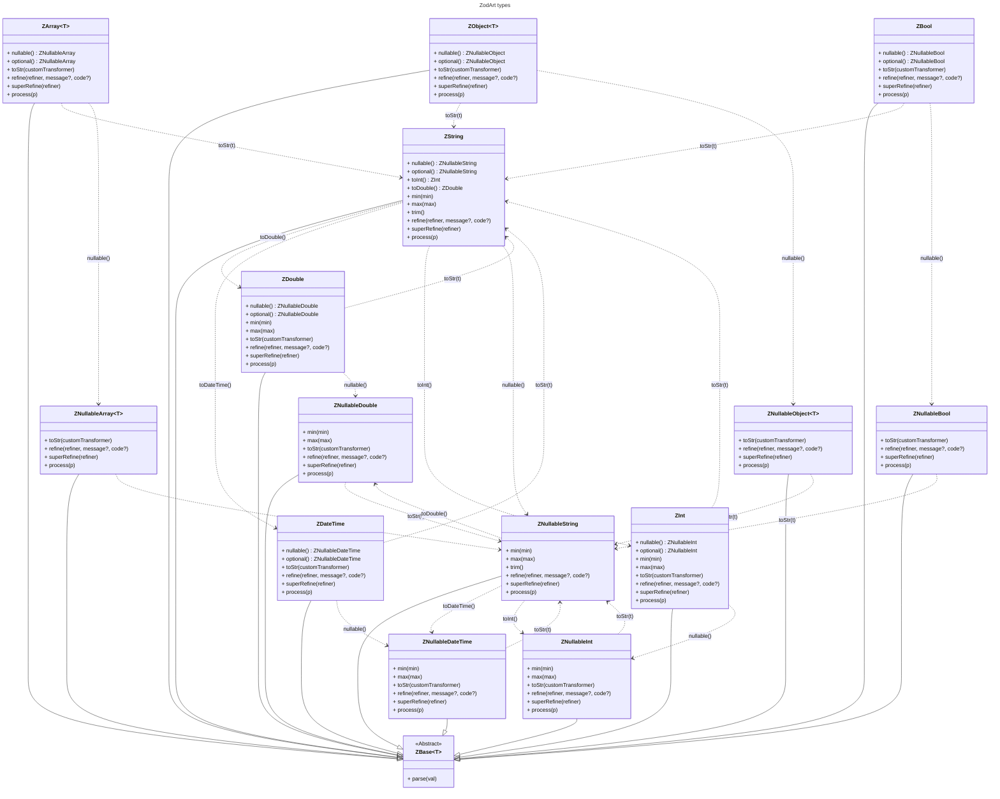

```mermaid
---
title: ZodArt types
---
classDiagram
    class ZBase~T~  {
        <<Abstract>>
        + parse(val)
    }

    class ZArray~T~ {
        + nullable() ZNullableArray
        + optional() ZNullableArray

        + toStr(customTransformer)

        + refine(refiner, message?, code?)
        + superRefine(refiner)
        + process(p)
    }

    class ZObject~T~ {
        + nullable() ZNullableObject
        + optional() ZNullableObject

        + toStr(customTransformer)

        + refine(refiner, message?, code?)
        + superRefine(refiner)
        + process(p)
    }

    class ZBool {
        + nullable() ZNullableBool
        + optional() ZNullableBool

        + toStr(customTransformer)

        + refine(refiner, message?, code?)
        + superRefine(refiner)
        + process(p)
    }

    class ZDateTime {
        + nullable() ZNullableDateTime
        + optional() ZNullableDateTime

        + toStr(customTransformer)

        + refine(refiner, message?, code?)
        + superRefine(refiner)
        + process(p)
    }

    class ZInt {
        + nullable() ZNullableInt
        + optional() ZNullableInt

        + min(min)
        + max(max)

        + toStr(customTransformer)

        + refine(refiner, message?, code?)
        + superRefine(refiner)
        + process(p)
    }

    class ZDouble {
        + nullable() ZNullableDouble
        + optional() ZNullableDouble


        + min(min)
        + max(max)

        + toStr(customTransformer)

        + refine(refiner, message?, code?)
        + superRefine(refiner)
        + process(p)
    }

    class ZString {
        + nullable() ZNullableString
        + optional() ZNullableString

        + toInt() ZInt
        + toDouble() ZDouble

        + min(min)
        + max(max)

        + trim()

        + refine(refiner, message?, code?)
        + superRefine(refiner)
        + process(p)
    }

    class ZNullableArray~T~ {
        + toStr(customTransformer)

        + refine(refiner, message?, code?)
        + superRefine(refiner)
        + process(p)
    }

    class ZNullableObject~T~ {
        + toStr(customTransformer)

        + refine(refiner, message?, code?)
        + superRefine(refiner)
        + process(p)
    }

    class ZNullableBool {
        + toStr(customTransformer)

        + refine(refiner, message?, code?)
        + superRefine(refiner)
        + process(p)
    }

    class ZNullableDateTime {
        + min(min)
        + max(max)

        + toStr(customTransformer)

        + refine(refiner, message?, code?)
        + superRefine(refiner)
        + process(p)
    }

    class ZNullableInt {
        + min(min)
        + max(max)

        + toStr(customTransformer)

        + refine(refiner, message?, code?)
        + superRefine(refiner)
        + process(p)
    }

    class ZNullableDouble {
        + min(min)
        + max(max)

        + toStr(customTransformer)

        + refine(refiner, message?, code?)
        + superRefine(refiner)
        + process(p)
    }

    class ZNullableString {
        + min(min)
        + max(max)

        + trim()

        + refine(refiner, message?, code?)
        + superRefine(refiner)
        + process(p)
    }

    ZArray --|> ZBase
    ZObject --|> ZBase
    ZBool --|> ZBase
    ZDateTime --|> ZBase
    ZInt --|> ZBase
    ZDouble --|> ZBase
    ZString --|> ZBase
    ZNullableArray --|> ZBase
    ZNullableObject --|> ZBase
    ZNullableBool --|> ZBase
    ZNullableDateTime --|> ZBase
    ZNullableInt --|> ZBase
    ZNullableDouble --|> ZBase
    ZNullableString --|> ZBase

    %% toStr %%
    ZArray ..> ZString : toStr(t)
    ZObject ..> ZString : toStr(t)
    ZBool ..> ZString : toStr(t)
    ZDateTime ..> ZString : toStr(t)
    ZInt ..> ZString : toStr(t)
    ZDouble ..> ZString : toStr(t)
    ZNullableArray ..> ZNullableString : toStr(t)
    ZNullableObject ..> ZNullableString : toStr(t)
    ZNullableBool ..> ZNullableString : toStr(t)
    ZNullableDateTime ..> ZNullableString : toStr(t)
    ZNullableInt ..> ZNullableString : toStr(t)
    ZNullableDouble ..> ZNullableString : toStr(t)
    %% \toStr %%

    ZString ..> ZDouble : toDouble()
    ZString ..> ZDateTime : toDateTime()
    ZString ..> ZInt : toInt()

    ZNullableString ..> ZNullableDateTime : toDateTime()
    ZNullableString ..> ZNullableDouble : toDouble()
    ZNullableString ..> ZNullableInt : toInt()

    ZArray ..> ZNullableArray : nullable()
    ZObject ..> ZNullableObject : nullable()
    ZBool ..> ZNullableBool : nullable()
    ZDateTime ..> ZNullableDateTime : nullable()
    ZInt ..> ZNullableInt : nullable()
    ZDouble ..> ZNullableDouble : nullable()
    ZString ..> ZNullableString : nullable()
```
