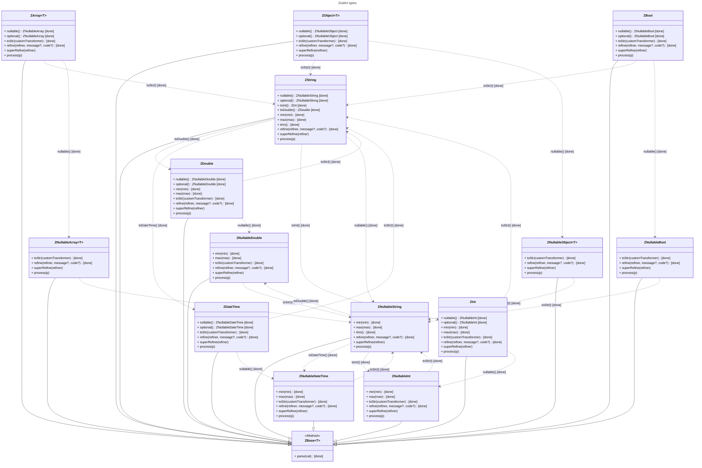

```mermaid
---
title: ZodArt types
---
classDiagram
    class ZBase~T~  {
        <<Abstract>>
        + parse(val) [done]
    }

    class ZArray~T~ {
        + nullable() ZNullableArray [done]
        + optional() ZNullableArray [done]

        + toStr(customTransformer) [done]

        + refine(refiner, message?, code?) [done]
        + superRefine(refiner)
        + process(p)
    }

    class ZObject~T~ {
        + nullable() ZNullableObject [done]
        + optional() ZNullableObject [done]

        + toStr(customTransformer) [done]

        + refine(refiner, message?, code?) [done]
        + superRefine(refiner)
        + process(p)
    }

    class ZBool {
        + nullable() ZNullableBool [done]
        + optional() ZNullableBool [done]

        + toStr(customTransformer) [done]

        + refine(refiner, message?, code?) [done]
        + superRefine(refiner)
        + process(p)
    }

    class ZDateTime {
        + nullable() ZNullableDateTime [done]
        + optional() ZNullableDateTime [done]

        + toStr(customTransformer) [done]

        + refine(refiner, message?, code?) [done]
        + superRefine(refiner)
        + process(p)
    }

    class ZInt {
        + nullable() ZNullableInt [done]
        + optional() ZNullableInt [done]

        + min(min) [done]
        + max(max) [done]

        + toStr(customTransformer) [done]

        + refine(refiner, message?, code?) [done]
        + superRefine(refiner)
        + process(p)
    }

    class ZDouble {
        + nullable() ZNullableDouble [done]
        + optional() ZNullableDouble [done]


        + min(min) [done]
        + max(max) [done]

        + toStr(customTransformer) [done]

        + refine(refiner, message?, code?) [done]
        + superRefine(refiner)
        + process(p)
    }

    class ZString {
        + nullable() ZNullableString [done]
        + optional() ZNullableString [done]

        + toInt() ZInt [done]
        + toDouble() ZDouble [done]

        + min(min) [done]
        + max(max) [done]

        + trim() [done]

        + refine(refiner, message?, code?) [done]
        + superRefine(refiner)
        + process(p)
    }

    class ZNullableArray~T~ {
        + toStr(customTransformer) [done]

        + refine(refiner, message?, code?) [done]
        + superRefine(refiner)
        + process(p)
    }

    class ZNullableObject~T~ {
        + toStr(customTransformer) [done]

        + refine(refiner, message?, code?) [done]
        + superRefine(refiner)
        + process(p)
    }

    class ZNullableBool {
        + toStr(customTransformer) [done]

        + refine(refiner, message?, code?) [done]
        + superRefine(refiner)
        + process(p)
    }

    class ZNullableDateTime {
        + min(min) [done]
        + max(max) [done]

        + toStr(customTransformer) [done]

        + refine(refiner, message?, code?) [done]
        + superRefine(refiner)
        + process(p)
    }

    class ZNullableInt {
        + min(min) [done]
        + max(max) [done]

        + toStr(customTransformer) [done]

        + refine(refiner, message?, code?) [done]
        + superRefine(refiner)
        + process(p)
    }

    class ZNullableDouble {
        + min(min) [done]
        + max(max) [done]

        + toStr(customTransformer) [done]

        + refine(refiner, message?, code?) [done]
        + superRefine(refiner)
        + process(p)
    }

    class ZNullableString {
        + min(min) [done]
        + max(max) [done]

        + trim() [done]

        + refine(refiner, message?, code?) [done]
        + superRefine(refiner)
        + process(p)
    }

    ZArray --|> ZBase
    ZObject --|> ZBase
    ZBool --|> ZBase
    ZDateTime --|> ZBase
    ZInt --|> ZBase
    ZDouble --|> ZBase
    ZString --|> ZBase
    ZNullableArray --|> ZBase
    ZNullableObject --|> ZBase
    ZNullableBool --|> ZBase
    ZNullableDateTime --|> ZBase
    ZNullableInt --|> ZBase
    ZNullableDouble --|> ZBase
    ZNullableString --|> ZBase

    %% toStr %%
    ZArray ..> ZString : toStr(t) [done]
    ZObject ..> ZString : toStr(t) [done]
    ZBool ..> ZString : toStr(t) [done]
    ZDateTime ..> ZString : toStr(t) [done]
    ZInt ..> ZString : toStr(t) [done]
    ZDouble ..> ZString : toStr(t) [done]
    ZNullableArray ..> ZNullableString : toStr(t) [done]
    ZNullableObject ..> ZNullableString : toStr(t) [done]
    ZNullableBool ..> ZNullableString : toStr(t) [done]
    ZNullableDateTime ..> ZNullableString : toStr(t) [done]
    ZNullableInt ..> ZNullableString : toStr(t) [done]
    ZNullableDouble ..> ZNullableString : toStr(t) [done]
    %% \toStr %%

    ZString ..> ZDouble : toDouble() [done]
    ZString ..> ZDateTime : toDateTime() [done]
    ZString ..> ZInt : toInt() [done]

    ZNullableString ..> ZNullableDateTime : toDateTime() [done]
    ZNullableString ..> ZNullableDouble : toDouble() [done]
    ZNullableString ..> ZNullableInt : toInt() [done]

    ZArray ..> ZNullableArray : nullable() [done]
    ZObject ..> ZNullableObject : nullable() [done]
    ZBool ..> ZNullableBool : nullable() [done]
    ZDateTime ..> ZNullableDateTime : nullable() [done]
    ZInt ..> ZNullableInt : nullable() [done]
    ZDouble ..> ZNullableDouble : nullable() [done]
    ZString ..> ZNullableString : nullable() [done]
```
